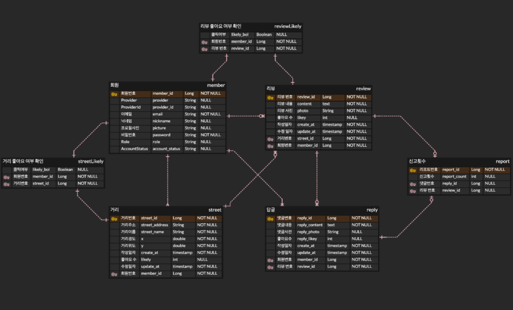
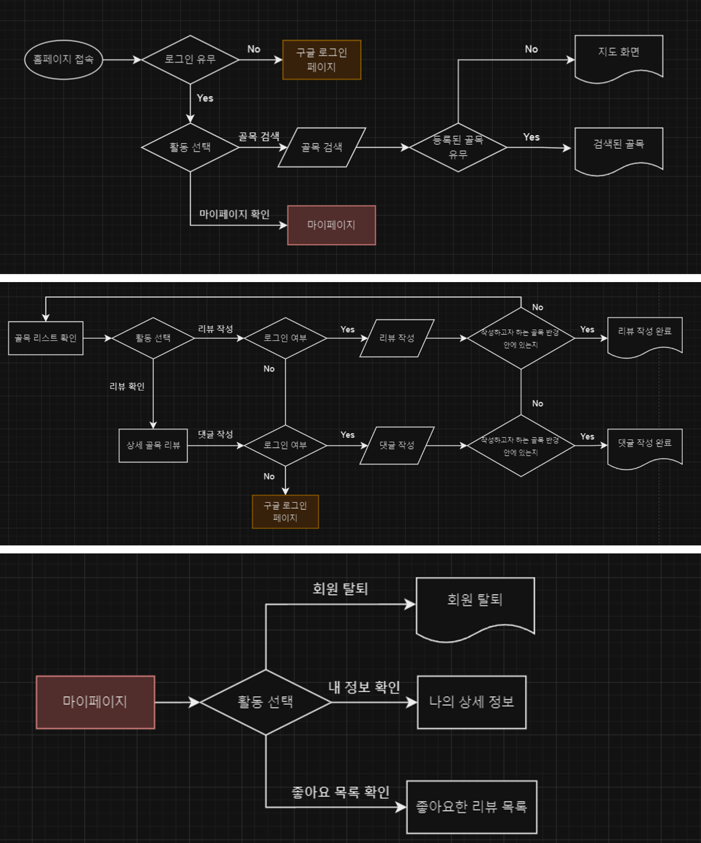

  
  <h1 float="right">GDSC Solution Challenge Backend Team</h1>

---
  

## 🧑🏻‍💻 프로젝트 목표 및 상세 설명

---

  

## 🛠️ 개발 언어 및 활용 기술

---
- Springboot
- Java 17
- Gradle
- Spring Data JPA
- MySQL
- MongoDB

  

## ⚙ 시스템 아키텍처

  

## 📄 ERD 설계

  
## 🌊 플로우 차트

